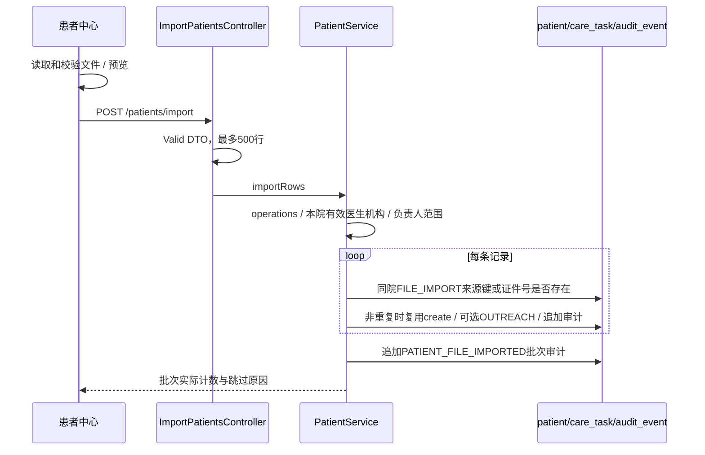

# HEALTH 1.8 患者中心批量导入契约

上游：[需求](../feature/patient-file-import-1.8.md)、[原型](../demo-static/web/admin/patient-file-import-1.8.html)。与患者池共用本地文件读取、编码、模板和预览交互，患者字段按本契约校验。



## 新增接口

`POST /bgssai/admin/patients/import`，独立 Controller，鉴权与限流沿用人工建档。

```json
{
  "import_batch":"B20261001-120000-000-a1b2c3d4",
  "doctor_id":2,
  "owner_id":3,
  "patient_type":"UNKNOWN",
  "source_scene":"MANUAL",
  "org_id":1,
  "outreach":true,
  "rows":[{"name":"虚构对象","gender":"UNKNOWN","age":66,"phone":"00000000001","department":"综合服务","disease":"虚构管理原因","external_id":"DEMO-001","id_card":"000000000000000001","birth_date":"1960-01-01","address":"虚构地址","emergency_contact":"虚构家属","emergency_phone":"00000000002","inpatient_no":"00001","bed_no":"01","note":"虚构示例"}]
}
```

`import_batch` 1–60 位字母/数字/短横线；`doctor_id/owner_id` 必填正整数；`rows` 1–500 条且不含 null；可选字段允许省略，`gender` 缺省 UNKNOWN。类型、来源、电话、长度、年龄、证件号与 `CreatePatientRequest` 一致。主管/运营/护士可用，运营/护士只能选择自己为 owner，DOCTOR/PLATFORM_ADMIN 拒绝。后台将空字符串可选字段视为未填，由浏览器省略。

成功统一响应：`result={import_batch,created,skipped,messages:[]}`；messages 中第 N 行指提交行序号，前端转换为实际文件行号。校验和分配错误整批拒绝。业务入口日志只记录批次和行数，不输出姓名、电话、证件或原文件。

## 原子写入和幂等

整个 `PatientService.importRows` 标注事务，复用内部 `create`，沿用每条档案审计与 SLA 首次联系任务逻辑，初始 ENROLLED/UNKNOWN。

来源 `source_system=FILE_IMPORT`。`hospital_patient_id`：有 external_id 用 `E:{external_id}`；否则用 `B:{import_batch}:{行序号}`，均不超过现有 120 字。查询与现有 `uk_patient_source(hospital_id,source_system,hospital_patient_id)` 共同防重；同医院已存在 `id_card` 也跳过，不按手机号合并。重试使用原批次与原行顺序，不修改已存在档案或创建重复任务。相同编号在其他医院不影响本院导入；任何重复反馈不透露其他患者字段。

档案详情的来源显示 FILE_IMPORT 为“文件导入”。新增批次审计 `PATIENT_FILE_IMPORTED`，只有批次与新增/跳过数量。结构与唯一索引已满足本版，无 SQL 迁移。

批次审计 `after_state=IMPORTED`，完整批次号放在 `detail`，满足状态列 32 字上限且保留最长 60 字批次。

表头白名单：姓名/name、性别/gender、年龄/age、联系电话/电话/手机号/phone、科室/department、病种/管理原因/病种/管理原因/disease、来源编号/external_id、证件号/身份证号/id_card、出生日期/birth_date、住址/地址/address、紧急联系人/emergency_contact、紧急联系电话/emergency_phone、住院号/inpatient_no、床号/bed_no、内部备注/备注/note。日期、编码、未识别列、重复表头与实际行号规则见[患者池通用解析设计](screening-file-import-1.8.md)。

## 原型交互与正式接口的对应（2026-10-02）

患者中心与专项 HTML 共用三步弹窗，页面入口和清单联动以[完整原型](../demo-static/web/interactive.html)为准。`patient-import-files.js` 由 `docs/demo-static/build-import-parser.mjs` 打包现有 `patientImport.js` / `fileImport.js`，离线提供同口径 Excel/CSV 解析、模板和校验，不引入新的字段契约。

第二步统一选择对应现有 `doctor_id/owner_id/patient_type/source_scene/org_id/outreach`；预览显示物理文件行号，错误阻止整批提交，重复来源编号或证件号预计跳过。确认后原型仅模拟内存建档、OUTREACH 任务与追加审计；正式应用继续使用本契约的 `/patients/import` 与后台最终查重。结果视图对应 `import_batch/created/skipped/messages`，可回到本批新增患者清单。浏览器演示结果不代表真实接口调用或数据库写入。

本次只完善原型交互，应用实现、接口与 SQL 沿用现有 1.8：无新增接口、枚举或数据结构。
