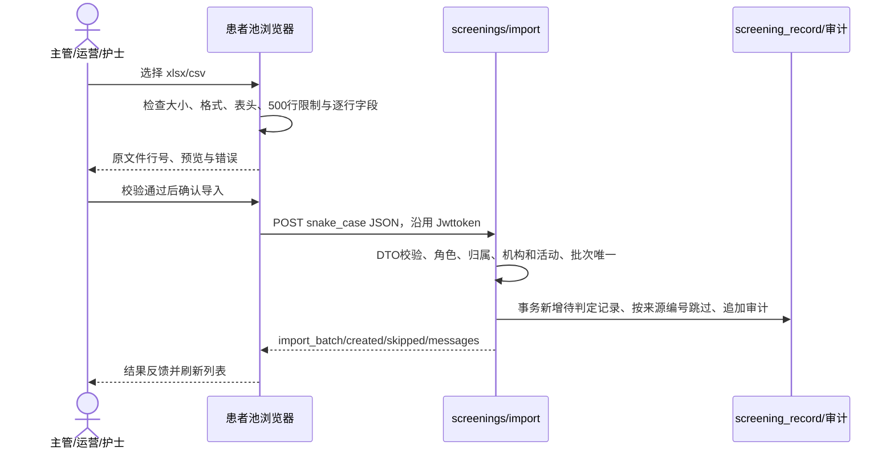

# HEALTH 1.8 患者池文件导入契约与设计

上游：[需求](../feature/screening-file-import-1.8.md)、[HTML 原型](../demo-static/web/admin/screening-file-import-1.8.html)。日期：2026-10-01。



## 页面与接口

新增入口仅在 `/screening` 原页面内打开弹窗，不增加路由和后台接口。文件在浏览器解析，不上传二进制、不保存原文件。模板为空白“患者池”表和“填写说明”表，使用 ExcelJS `xlsx.writeBuffer()`；读取使用 `xlsx.load(ArrayBuffer)`，库只在用户读取 Excel 或下载模板时加载。已核对 [ExcelJS 官方文档](https://github.com/exceljs/exceljs#browser) 支持浏览器文档工作簿与上述 API。CSV 使用 Papa Parse 的引号/换行解析能力，编码由 TextDecoder 处理。

复用 `POST /bgssai/admin/screenings/import`，body：

```json
{
  "source_type": "ECG_NETWORK",
  "import_batch": "B20261001-120000-000-a1b2c3d4",
  "org_id": 1,
  "campaign_id": 1,
  "owner_id": 1,
  "rows": [{"name":"虚构示例","gender":"MALE","age":66,"phone":"00000000001","finding":"虚构筛查结论","external_id":"DEMO-001","id_card_tail":"001234","screened_at":"2026-09-30T08:30:00","category":"筛查"}]
}
```

`org_id/campaign_id/owner_id` 及行内可选字段可省略。`import_batch` 用时间（含毫秒）与随机后缀生成，保持同一次弹窗提交使用相同批次号，避免失败重试静默重复写入。服务端批次规则、事务、校验、同医院同来源编号去重、`SCREENING_IMPORTED` 审计事件和成功响应 `result={import_batch,created,skipped,messages:[]}` 不变。角色沿用 1.6：主管、运营、护士可导入；医生、平台管理员拒绝；执行者只能归属自己。

## 解析与校验

表头映射固定白名单：姓名/name、性别/gender、年龄/age、联系电话或电话或手机号/phone、发现时间或筛查时间/screened_at、发现结论或发现/检查结论或检查结论/finding、分类/category、来源编号/external_id、证件尾号/id_card_tail。字段顺序不受限，其他表头作为未导入列显示；空表头列有数据时拒绝，防止错位丢失。重复同义字段和缺少必填列直接拒绝。

首个非空行作为表头，空数据行不计数，但保留 CSV 物理行号 / Excel 工作表行号用于反馈。CSV 分隔符自动识别逗号、分号或制表符；引号内换行、双引号由解析器处理。UTF-8 解码失败后使用 GB18030；带 BOM 的 UTF-16 显式选择对应解码器。非法 CSV 语法整文件拒绝。

Excel 使用首个非空工作表，日期单元格以 UTC 日期分量还原表格显示时间（无时区本地日期时间），不按用户时区偏移。文本日期必须严格匹配需求规定格式，不接受日期溢出自动修正。文本、数字和富文本单元格可读取；公式、错误和无法识别的单元格拒绝并反馈该行。字段约束对齐 `ImportScreeningRequest.Row`；任何错误阻止整个文件提交，不自动删除错误行。展示完整分页预览与错误明细；后台再次校验，浏览器不能替代后台验证。

关闭和重选递增读取序号，迟到的异步读取结果不得覆盖新文件；提交忙碌锁阻止取消、换文件与重复提交。所有本地文件引用与预览随弹窗卸载清空。接口失败保留预览便于核对；重复批次和超时沿用后台/接口实际错误，不显示导入成功。

## 数据库层

继续写入 `screening_record` 的现有字段与 `NEW/UNKNOWN` 状态，无新增列、枚举、索引或迁移 SQL。原文件行号仅用于本地预览；后台 `messages` 的第 N 行指提交记录序号，前端结果转换为对应文件行号。

批次审计 `after_state=IMPORTED`，完整批次号写入 `detail`（`batch=...; source=...; created=...; skipped=...`），避免合法的 60 字批次号超过状态列 32 字上限。审计仅追加。
