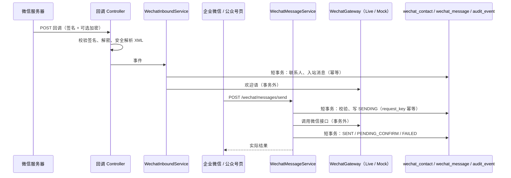

# HEALTH 1.9 企业微信与公众号契约

上游：[需求](../feature/wechat-channels-1.9.md)、[原型](../demo-static/web/admin/wechat-channels-1.9.html)。管理端接口前缀 `/boruikang/admin`，沿用 Jwttoken、snake_case、`ApiResponse` 与限流；回调接口前缀 `/boruikang/open`，不带登录，凭微信签名校验。



网络调用一律在数据库事务之外。先写 `SENDING` 再调用接口：进程在两步之间中断时记录停在"发送中"，不会重发，也不会显示成功。

## 接入配置

`GET /integrations` 沿用。WE_COM、WECHAT_OFFICIAL 两项改为真实状态，响应新增字段（AI 项为空）：

```json
{"provider":"WE_COM","enabled":true,"configured":true,"status":"CONNECTED","app_id":"ww0000000000000000","mode":"LIVE","callback_ready":true,"callback_path":"/boruikang/open/wecom/callback/1","verified_at":"2026-10-04T10:00:00","last_error":null,"mock_allowed":false}
```

`status`：未填 app_id 或 secret 为 NOT_CONFIGURED；已配置且 `mode=MOCK` 为 MOCK；其余按最近一次测试为 CONFIGURED_UNVERIFIED、CONNECTED 或 FAILED。是否启用由 `enabled` 单独表示。`callback_ready` 表示已保存回调 Token（企业微信还须有 AESKey）。`mock_allowed` 表示本环境允许选择模拟通道。密钥、Token、AESKey 不出现在任何响应中。

`POST /integrations/wechat/save`（MANAGER、PLATFORM_ADMIN）

```json
{"provider":"WECHAT_OFFICIAL","app_id":"wx0000000000000000","secret":"","callback_token":"","aes_key":"","mode":"LIVE","enabled":true}
```

`secret`、`callback_token`、`aes_key` 留空保留原值。`callback_token` 3–32 位字母数字；`aes_key` 43 位。启用要求 app_id 与 secret 齐全；企业微信启用还要求 Token 与 AESKey（回调必须加密）。`mode=MOCK` 仅在 `health.wechat.mock-allowed=true` 时接受。app_id、secret 或 mode 变化时清空 verified_at 与 last_error。写审计 `INTEGRATION_UPDATED`。

`POST /integrations/wechat/verify`（MANAGER、PLATFORM_ADMIN）`{"provider":"WE_COM"}` → 同上响应。真实调用取凭证接口；失败不抛错，返回 `status=FAILED` 与 `last_error`（如 `40013 invalid appid`）。未保存凭证或通道为 MOCK 时返回 400。

## 回调（公开）

| 方法与路径 | 作用 |
| --- | --- |
| `GET /boruikang/open/wecom/callback/{hospital_id}` | 企业微信 URL 验证：校验 `msg_signature`，解密 `echostr` 后原样返回明文 |
| `POST /boruikang/open/wecom/callback/{hospital_id}` | 企业微信事件：校验签名、解密，处理 `change_external_contact`，返回 `success` |
| `GET /boruikang/open/wechat/callback/{hospital_id}` | 公众号 URL 验证：校验 `signature`，返回 `echostr` |
| `POST /boruikang/open/wechat/callback/{hospital_id}` | 公众号消息与事件：明文或 `encrypt_type=aes`，返回 `success` |

通道未配置、未启用或签名不符返回 403；请求体超过 64 KiB 返回 413；XML 解析禁用 DTD 与外部实体。处理的事件：

- 企业微信 `change_external_contact`：`add_external_contact`、`add_half_external_contact` 建或恢复联系人，记录 `UserID`、`State`、`WelcomeCode`；`del_external_contact`、`del_follow_user` 标为 REMOVED。其他事件忽略。
- 公众号：`subscribe`（EventKey `qrscene_` 前缀去掉后为渠道参数）、`SCAN`、`unsubscribe`、`TEMPLATESENDJOBFINISH`（按 MsgID 回写模板消息结果）、`text`、其他消息类型（记为一条内容是「[图片]」「[语音]」等的入站消息，同样待处理）。除取消关注和送达回执外，都刷新联系人的最后互动时间。

幂等键：公众号消息用 `MsgId`，事件用 `FromUserName + CreateTime + Event`；企业微信用 `ExternalUserID + UserID + ChangeType + CreateTime`。渠道参数格式 `ch<渠道 id>`。

## 微信联系人

`POST /wechat/contacts/query`（MANAGER、OPERATOR、NURSE；DOCTOR 仅可带自己患者的 `patient_id`）

```json
{"page":0,"size":10,"channel":"WE_COM","bound":true,"pending":true,"relation":"ACTIVE","keyword":"","patient_id":1001}
```

OPERATOR、NURSE 必须带 `bound`：`true` 只返回自己负责患者的联系人，`false` 返回待绑定联系人。响应项：

```json
{"id":1,"channel":"WE_COM","external_id":"wm…","nickname":"虚构昵称","staff_user_id":"zhangsan","staff_account_id":3,"intake_channel_id":1,"relation":"ACTIVE","followed_at":"…","removed_at":null,"last_inbound_at":"…","last_message_at":"…","last_message_preview":"…","pending_count":1,"patient_id":1001,"patient_name":"演*","bound_at":"…","mock":false,"version":2}
```

`POST /wechat/contacts/sync`（MANAGER）`{"provider":"WE_COM"}` → `{"scanned":12,"created":3,"updated":9,"truncated":false}`。企业微信只同步已登记成员账号的客户。

`POST /wechat/contacts/bind` `{"id":1,"version":2,"patient_id":1001}`；`POST /wechat/contacts/unbind` `{"id":1,"version":3,"reason":"绑定错人"}`。绑定锁患者行并校验可见范围；版本不符返回 409。审计 `WECHAT_CONTACT_BOUND` / `WECHAT_CONTACT_UNBOUND`。

`POST /wechat/contacts/handle` `{"id":1}`：把该联系人的待处理来信全部标为已处理；重复调用无副作用。

## 微信消息

`POST /wechat/messages/query` `{"contact_id":1,"page":0,"size":20}`，按时间倒序。已绑定联系人按患者范围校验；未绑定联系人仅运营角色可看。

```json
{"id":9,"contact_id":1,"channel":"WECHAT_OFFICIAL","direction":"OUTBOUND","kind":"TEMPLATE","content":"thing1=复诊提醒\ntime2=2026-10-08","template_code":"MP_REVISIT","task_id":null,"status":"SENT","external_msg_id":"200228332","error":null,"actor_id":3,"sent_at":"…","handled_at":null,"mock":false}
```

`POST /wechat/messages/send`（MANAGER、OPERATOR、NURSE）

```json
{"contact_id":1,"kind":"TEXT","content":"您好，这里是健康管理团队。","template_code":null,"task_id":null,"request_key":"uuid"}
```

| kind | 规则 |
| --- | --- |
| TEXT | `content` 必填。公众号要求最后互动在 48 小时内，UTF-8 不超过 2048 字节；企业微信不超过 4000 字节，联系人须有添加成员 |
| TEMPLATE | 仅公众号。`template_code` 指向启用的 MP_TEMPLATE 模板且已登记微信模板 ID；`content` 为每行 `字段=内容`，字段名 `[A-Za-z0-9_]{1,32}`，至少一行 |
| APPROVED_ADVICE | `task_id` 必填，联系人须已绑定该任务的患者；任务为 FOLLOWUP 或 CONSULTATION、状态 APPROVED、审核人等于患者当前责任医生；正文取 `approved_text`，忽略请求里的 `content`；按文字通道发送，48 小时互动要求与长度限制同 TEXT |

通道须启用且已配置，联系人须 ACTIVE。相同 `request_key` 再次提交返回第一次的记录，不再调用接口。接口失败返回 200，记录 `status=FAILED` 与 `error`。停在 SENDING 的记录没有重试接口，再次发送须用新的 `request_key`。发送成功后该联系人的待处理来信标为已处理。审计 `WECHAT_MESSAGE_SENT`，detail 只含 kind、状态与消息 id，不含正文。

`POST /wechat/messages/refresh` `{"id":9}`：仅企业微信 `PENDING_CONFIRM` 记录，查询群发结果后更新为 SENT、FAILED 或保持不变。

`POST /wechat/messages/consult` `{"id":12}`：把已绑定患者的一条入站文字转成 CONSULTATION 任务（`request_key=wechat-consult-<id>`），写 `care_message` 患者原始咨询，把这一条来信标为已处理，返回任务 `TaskResponse`。重复调用返回同一任务。

`POST /wechat/mock/inbound`（MANAGER，通道须为 MOCK）`{"provider":"WECHAT_OFFICIAL","event":"TEXT","external_id":"mock-openid-1","text":"请问复诊要带什么","channel_id":1,"staff_user_id":null}`，`event`：FOLLOW、TEXT、UNFOLLOW。走与真实回调相同的处理。

## 渠道、账号、模板、任务的变更

- `POST /channels/wechat-qr`（MANAGER）`{"id":1,"provider":"WE_COM"}` → `ChannelResponse`，新增 `wecom_qr_url`、`official_qr_url`。企业微信要求渠道负责人已登记成员账号。
- `POST /accounts/wecom`（MANAGER）`{"id":3,"wecom_user_id":"zhangsan"}`，空串表示清除；同院内成员账号不重复。`/accounts/query` 响应新增 `wecom_user_id`。
- `/templates/save`、`/templates/query`：`channel` 增加 MP_TEMPLATE，`scene` 增加 WELCOME，新增 `external_template_id`（MP_TEMPLATE 必填）。欢迎语用 `channel=WECHAT`、`scene=WELCOME`，正文不能含 {占位}；企业微信凭回调里的 WelcomeCode 发送，公众号用客服消息发送。
- `/tasks/contact`、`/tasks/attempt`：`method` 增加 WECHAT。
- `/patients/timeline`：新增 `WECHAT` 类事件。

## 微信侧接口（LiveWechatGateway）

主机固定为 `https://qyapi.weixin.qq.com` 与 `https://api.weixin.qq.com`，不可配置。凭证按配置缓存到过期前 5 分钟；返回 40001、40014、42001 时清缓存重试一次。日志不输出 URL、凭证与正文。

| 用途 | 接口 |
| --- | --- |
| 企业微信凭证 | `GET /cgi-bin/gettoken` |
| 客户详情（批量） | `POST /cgi-bin/externalcontact/batch/get_by_user` |
| 联系我二维码 | `POST /cgi-bin/externalcontact/add_contact_way` |
| 群发任务与结果 | `POST /cgi-bin/externalcontact/add_msg_template`、`get_groupmsg_send_result` |
| 欢迎语 | `POST /cgi-bin/externalcontact/send_welcome_msg` |
| 公众号凭证 | `POST /cgi-bin/stable_token` |
| 关注者 | `GET /cgi-bin/user/get`、`POST /cgi-bin/user/info/batchget` |
| 带参二维码 | `POST /cgi-bin/qrcode/create`（QR_LIMIT_STR_SCENE） |
| 客服消息、模板消息 | `POST /cgi-bin/message/custom/send`、`/cgi-bin/message/template/send` |

## 权限矩阵

| 接口 | MANAGER | OPERATOR / NURSE | DOCTOR | PLATFORM_ADMIN |
| --- | --- | --- | --- | --- |
| 配置保存、测试连接 | ✓ | ✗ | ✗ | ✓ |
| 联系人查询 | 全院 | 待绑定 + 自己的患者 | 仅自己患者（只读） | ✗ |
| 同步、活码、成员账号、模拟来信 | ✓ | ✗ | ✗ | ✗ |
| 绑定、解绑、发送、刷新结果、处理、转咨询 | ✓ | 范围内 | ✗ | ✗ |
| 消息查询 | ✓ | 范围内 | 仅自己患者 | ✗ |

## 用户端

HEALTH-USER 没有新增接口。介绍页的"微信互动"演示是页面内的固定虚构脚本，不请求后端，也不连接微信。
