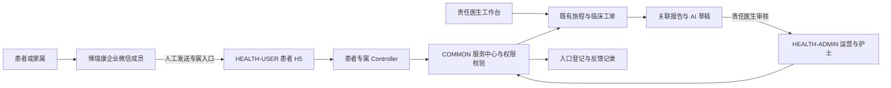

# 患者全程服务中心 2.1：系统设计整合

更新日期：2026-10-09。输入为本聊天中确认的患者服务 H5 功能拆解；首期使用博瑞康企业微信，服务江阴人民医院心血管科。本文定义当前系统的目标增量；本分支基于 develop 2.0，未包含先前草稿 PR #20 的业务代码，不能据此宣称已上线。

## 模块定位与架构
患者 H5 是微信内打开的服务网页，无需安装 App。企微承载人工沟通与链接分发，H5 承载结构化登记、授权、服务摘要和反馈。沿用 Java/Spring Boot、MyBatis、React 与 MySQL 的现有模块，不拆新微服务。

平台与企微主体是博瑞康；患者 hospital_id、科室、责任医生与服务负责人仍按医院业务归属隔离。HEALTH-USER 保留公开介绍，并增加 /service 受邀入口；不建立公开注册或患者账号系统。

## 功能拆解与现有模块映射
| 功能 | 患者操作或状态 | 后台职责 | 复用与增量 |
| --- | --- | --- | --- |
| 进入服务 | 扫码加博瑞康企微，打开专属链接 | 成员同步联系人、签发入口 | 复用渠道、wechat_contact；新增 patient_service_entry |
| 登记与授权 | 姓名、联系手机号、本人/家属、全程/诊后需求、确认授权 | 接收待核实登记 | H5 登记页；保存授权版本和时间 |
| 人工核实 | 等待身份和家属权限核实 | 核实后绑定已授权患者，指定负责人及医生 | 复用患者档案、联系人绑定；禁止姓名/手机号自动合并 |
| 服务安排 | 查看诊前、诊中、诊后阶段摘要 | 创建并办理门诊或出院旅程 | 复用 service_journey 及其阶段，不增加第二套旅程状态机 |
| 反馈 | 选择本次服务，提交咨询、随访反馈、投诉 | 服务队列受理；临床问题交责任医生 | 新增 patient_service_feedback，关联 journey_case |
| 反馈进度 | 查看待受理、已受理、已处理、结案 | 办理结果与审计留痕 | 由服务端映射工单状态，不能以发送成功表示患者已读 |
| AI 辅助 | 获得人工提供且医生已审核的建议 | 点击起草、责任医生本人审核、运营/护士执行 | 复用现有报告关联与随访审核；不增加 AI 自动问诊 |
| 撤销与退出 | 联系团队撤回授权 | 撤销入口、办理退出及授权撤回 | 复用患者/旅程状态；即时阻断患者业务访问 |

原型：[患者全程服务中心双端预览](../demo-static/web/patient-service-center.html)，支持入组、核实、反馈工单和失效场景；仅本页虚构状态。

## 页面与闭环
管理端增加“企微患者全程服务中心”：入口签发、登记队列、人工核实绑定、撤销入口；跳转既有旅程、随访、咨询异常与接入设置。医生继续使用现有审核与临床工单页面。
患者端按服务状态显示登记、等待核实、我的旅程、提交反馈及反馈进度。仅返回当前令牌绑定患者的阶段摘要和反馈；不展示未审核建议、内部病历全文、其他患者或工作人员内部备注。

闭环：渠道扫码 → 添加企微成员 → 人工签发 7 天链接 → 患者登记授权 → 核实绑定 → 建立门诊/出院旅程 → 诊前准备/诊中协助/诊后随访 → 反馈生成工单 → 服务人员或责任医生处理 → 患者查看进度 → 退出或结案。登记、绑定、旅程创建、工单处理分别代表不同业务事实，不自动相互完成。

## 数据与接口契约
增量表 patient_service_entry 保存联系人、医院、令牌哈希、到期时间、登记信息、授权版本、核实患者及状态；patient_service_feedback 保存入口、患者、旅程、工单、请求键和内容指纹。旧记录保留历史授权版本，新授权文案采用 patient-service-2.1-brk。字段和 DTO 以 PR #20 的 2.1 契约为接入依据，合并时再验证生成物，不能仅改版本标签。
管理接口：issue / query / verify / revoke；患者接口：portal / register / feedback，归于 service_center 命名空间，每个接口独立 POST Controller 和 DTO。医院、角色、操作者及患者范围从服务端可信上下文判定。

入口状态 ISSUED → REGISTERED → VERIFIED；撤销进入 REVOKED。到期与业务授权撤回即使不改登记状态，也必须拒绝访问。反馈状态跟随关联工单，不让患者任意写 status。

## 权限、失败与验证
令牌使用随机高熵原文，仅签发时展示，数据库保存 SHA-256；以 URL fragment 进入，随后移除地址栏令牌，不进入查询参数、日志或持久 localStorage。页面与患者 API 使用 no-store，设置 referrer 限制和速率限制。
运营/护士只管理获授权的成员联系人或本人负责患者；主管按本院范围管理，平台管理员不能读取患者，临床处置仅责任医生本人。反馈幂等校验请求键及内容指纹；核实采用版本校验，绑定和建单同事务，患者及旅程锁防止退出并发；审计只追加。
链接过期、重签撤销、联系人失联/解绑/改绑、患者暂停/结案/授权撤回、旅程关闭均需失败关闭；网络失败可重试，不能伪造成功。接口异常仅返回必要说明，不泄露患者身份。
验收覆盖完整登记绑定闭环、家属待核实、跨院/跨患者拒绝、旧令牌失效、撤回授权阻断、反馈幂等及关闭并发、临床角色限制、手机端可用性及敏感信息缓存。以实际测试和企微接口返回判断接通。

## 架构决策
ADR-01：采用受邀 H5 而非新增患者登录体系。好处是延用企微关系、减少首期账号成本；代价是链接泄露和到期管理，需要令牌控制及人工核实。
ADR-02：复用现有旅程、工单、AI 审核。减少双状态机及运营学习成本；代价是患者视图须显式映射，禁止直接返回后台 Entity。
ADR-03：首期单院服务范围配置博瑞康企微。保留医院数据隔离；暂不将同一企微凭证复制到多院。未来多院共享需要独立设计企业账户与医院映射、回调路由、联系人去重和成员授权。

## 实施与交付边界
先审核设计与原型，再接入 PR #20（https://github.com/boruikang846-a11y/boruikang-health/pull/20）的 2.1 实现及加法迁移，核对最新 develop 冲突，执行契约校验、事务/HTTP 测试和两端构建；经授权后按现有部署仓流程发布，最后在配置页录入真实凭证、验证 HTTPS 域名、回调、成员映射及虚构患者闭环。禁止清库、仓库保存凭证或使用真实患者做演示。
本轮不包含挂号预约、报告展示、在线诊疗、AI 自动问诊、自动提醒、全量聊天存档或运营大屏。服务协助中的预约协助不等于接通医院预约系统。真实企微尚待联调，不承诺即时医疗响应。

## 全流程诊后个案设计补充（2026-10-09）
详细内容见 [全流程诊后服务设计](after-care-full-process-2.1.md)，页面见 [诊后个案工作区](../demo-static/web/interactive.html#/after-care)。门诊和体检各六环节，住院与出院八环节。新增流程属于设计探索；正式系统复用单套旅程状态机，体检路径、AI生成节点与流程顺序需后续落实到业务契约及加法迁移，不能凭HTML宣称业务API已经支持。
