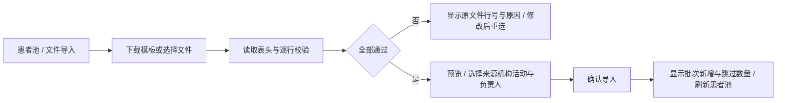

# HEALTH 1.8 患者池文件导入

版本：1.8，2026-10-01。用户要求在管理端 `/screening` 患者池添加文件导入。保留 1.5–1.7 的患者池判定、建档、权限与随访审核流程。

## 操作流程

## 文件与字段

- 支持 `.xlsx`、`.csv`，单文件最多 5 MiB、500 条非空数据行；不支持 `.xls`。Excel 使用第一个非空工作表并显示工作表名称。首个非空行必须是表头，可调整列顺序。
- 提供 Excel 空白模板；另一个“填写说明”工作表包含字段说明和虚构示例，不作为待导入数据。
- 表头支持中文及对应 snake_case 字段。必填列与值：姓名 `name`、联系电话 `phone`、发现结论 `finding`。
- 可选：性别 `gender`、年龄 `age`、发现时间 `screened_at`、分类 `category`、来源编号 `external_id`、证件尾号 `id_card_tail`。性别为空按 UNKNOWN，年龄为空保持空值，发现时间为空由服务端使用导入时间。
- 电话及编号按文本读取，保留前导零。Excel 模板将电话、编号、证件尾号设为文本。日期支持 Excel 日期单元格或 `YYYY-MM-DD` / `YYYY-MM-DD HH:mm[:ss]` 文本（分隔符可为 `/`，日期时间可用 `T`）。CSV 支持 UTF-8（含 BOM）、GB18030 和带 BOM 的 UTF-16；引号中的逗号、换行与双引号须正确解析。
- 未识别的附加列显示提示并不参与导入；缺失必填表头、同义表头重复、非法 CSV / 损坏 Excel、错误格式、超限、空文件均拒绝。
- 姓名最多 80 字，电话符合 `[+0-9 -]{6,24}`，结论最多 1000 字，分类和来源编号最多 80 字，证件尾号最多 6 字；年龄必须为 0–130 的整数，性别只接受男、女、未知或 MALE/FEMALE/UNKNOWN；非空非法日期拒绝。

## 交互与权限

患者池顶部新增“文件导入”，保留“粘贴导入”“人工录入”。弹窗包含模板下载、单文件选择、来源必选、机构和活动可选；主管可选择负责人，运营人员和护士按现有接口归属自己。显示文件名、Excel 工作表名、记录数、可分页预览和全部错误行及原因。有任何校验错误不允许提交；切换文件时清空旧预览，读取中和提交中防止重复操作，关闭后不保留文件内容。

读取和校验在浏览器内完成，点击“确认导入”才将标准化字段提交现有 `POST /bgssai/admin/screenings/import`。同医院、同来源的已存在 `external_id` 跳过，包括文件内重复编号；不按手机号合并档案。提交失败保留当前预览，成功显示批次、新增数量、跳过数量与明细，刷新列表。服务端继续执行校验、权限检查、事务写入与追加审计。文件只生成待判定记录，不自动判定高危或建档。

## 验收

| 编号 | 可验证结果 |
| --- | --- |
| F01 | 模板可下载，表头与文本列格式正确，空模板不会误导入说明与示例 |
| F02 | Excel 日期、中文/英文表头、乱序列、电话及证件尾号前导零正确读取 |
| F03 | CSV 中文编码、带引号的逗号/换行/双引号正确解析 |
| F04 | 非法年龄、性别、电话、日期及字段超长显示实际行号；任一错误阻止提交 |
| F05 | 空文件、无必填表头、重复表头、损坏文件、超过 5 MiB 或 500 行拒绝，旧预览不被继续提交 |
| F06 | 正确文件确认后新增记录，重复来源编号跳过，返回实际批次结果并刷新 |
| F07 | 取消、重选、读取失败、接口失败、重复点击、读取中关闭再打开不会误用旧文件 |
| F08 | 主管、运营、护士沿用原有权限；医生与平台管理员无法通过导入接口写患者池 |

本版复用现有 DTO、表结构和审计事件；数据库层不涉及新增字段或迁移 SQL。
