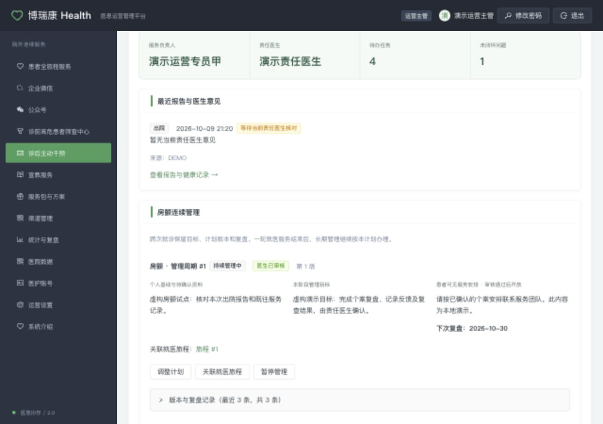

# 2.2 验收与验证记录

日期：2026-10-09。以下本地测试仅使用虚构数据；真实企微、医院接口与真实患者尚未验收，不能写作已上线。

## 一例完整案例：验证流程

1. 已确认的医院患者主档与授权、服务负责人、责任医生；博瑞康企微联系人。签发 → 受邀登记 → 人工核实本人 / 家属和授权，不按手机号自动合并。
2. 开启诊后旅程，责任人接单；核对报告，责任医生本人审核个案计划后生成任务。
3. 建立房颤长期计划，关联本次旅程；责任医生确认基线、目标、患者说明与下一复盘日期；H5 只看到批准版。
4. 执行随访、患者 H5 反馈、工单接单、医生处理临床问题、发布患者说明、核验已反馈，医生查收任务结果。
5. 预约及独立到院 / 复诊证据满足既有结案条件；单次旅程结束，长期计划继续在管。
6. 医生复盘并保留结果依据；再次就诊关联原计划，查看跨次历史、指标和下一安排。
7. 额外检查：退回 / 调整后隐藏草稿，跨医院 / 患者拒绝，旧版本冲突，重复提交不重复建单，邀请撤销 / 续签 / 授权撤回即时阻断；新授权不恢复旧入口。

一例证据包应串起匿名试点编号、患者主档编号、contact / entry、journey、报告、个案计划、task、case、长期 plan / revision、appointment、医生确认与审计时间。实际证据按医院授权保留，不把真实患者数据放 Git。

## 一批连续入组患者：验证稳定性与实际结果

试点开始前由业务负责人和责任医生锁定入组起止时间、纳排条件、观察截止日期、各指标达标阈值以及复盘安排。连续记录全部符合条件并被邀请的房颤患者，不挑选成功案例；样本数随患者流量确定，不把本地 40 位虚构数据当作临床样本量。未到观察节点、失访、拒绝、撤回、医生确认无需复诊分别编码，不能悄悄删去。

| 指标 | 分子 / 分母 | 时间及来源 |
| --- | --- | --- |
| 登记与核实完成率 | 完成人工核实人数 / 符合试点条件且已邀请人数；同时记录未登记、待核实原因 | 固定入组窗与截止日；entry 与人工核验依据 |
| 有效联系率 | 有身份核验及有效沟通记录人数 / 截止日前应联系人数 | 人工联系记录；接口受理不算有效联系 |
| 反馈闭环率 | 已处理且核验反馈的工单数 / 截止日前应完成工单数 | 工单与审计；未收到单列，发布回复不算已收到 |
| 应复盘完成率 | 已有责任医生阶段复盘人数 / 截止日前应复盘的在管人数 | 长期计划与追加复盘；暂停 / 撤回单列并说明发生时间 |
| 核验到院率 | 有医院就诊事实或明确人工核验凭据人数 / 观察窗内已预约且应到院人数 | 预约、到院凭据；医院事实与人工核验分层，患者自述另列 |
| 符合条件的复诊完成率 | 已核验复诊及诊疗结果人数 / 责任医生确认需要且截止前应复诊人数 | 旅程 / 预约 / 医生判断；无需复诊、尚未到期单列 |
| 技术稳定性 | 成功请求 / 合法请求；错误、重试、重复记录、遗漏反馈、越权问题分别统计 | 应用日志、去重键、数据库审计；不把 4xx 全算系统失败 |
| 工作效率 | 每例服务耗时、审核等待时间的分布与可比基线 | 人工时间记录及任务 / 审核时间；缺失数据单列 |

每项同时展示分子、分母、窗口、排除项数量及理由、来源缺失数。追踪链接只证明来源 / 点击；“接受服务后到院”不能直接解释为“服务促成到院”。本轮尚无真实连续队列结果，也未新建完整统计看板，按上述清单人工核对原始记录。

## 本地验证

- Java 全量 `mvn -o -B verify`：最终本地回归 143 项通过、28 项 MySQL 专项跳过（含本轮增加的 11 项）。零失败、零错误；MySQL 结果单独由 CI 验证。
- PatientServiceCenterTest 覆盖 21 项，包括 40 位连续虚构患者、每人两次旅程、重复反馈去重、跨患者 / 医院隔离、授权撤回再授权、旧入口失效。
- JourneyHttpTest 覆盖 11 项；单例串起受邀服务、报告 / 个案审核、患者反馈工单与公开回复、医生查收、独立复诊核验、阶段复盘及再次就诊；并发更新一项成功、一项 409。
- 两个 React 生产构建与静态资源同步通过；管理端 23 项测试通过；8 个离线原型套件通过。
- 两份生成契约检查通过：39 表 / Model / Mapper 一致；13 个新增与受邀管理端接口、3 张连续管理表增量结构一致。
- 浏览器使用独立 H2 虚构库核查正式 React：管理端创建计划与待审 / 已审显示、报告和待办聚合；患者端 390×844 手机视口显示已审核安排、模拟标签、反馈处理角色及下一步。两端控制台未见错误。发现并修复操作按钮挤压标题、诊后受邀旅程的阶段标签问题。
- CI 已增加 MySQL 8.4 加法迁移结构比对（2.1 → 2.2 对照全量五张相关表），并复用 11 项旅程 / 连续管理 HTTP 契约。本地 H2 通过不代替该 MySQL 检查。

## 真实试点接入待办

- 配置博瑞康企微凭据、成员范围、回调地址；确认配置与联系人属于试点医院服务范围，实测真实接口返回和成员确认。
- 配置患者端 HTTPS 域名 health.user-url，检查患者手机从企微打开、隐私授权、撤销与重新核实；不在日志记录邀请原文。
- 医院确认患者身份规则，以及至少一种报告 / 预约 / 到院事件链路与数据来源。当前只有 Mock / 手工凭据，不标为自动医院核验。
- 责任医生确认房颤试点纳排条件、个体目标、复盘节点和临床异常处置要求。
- 完成迁移演练和备份恢复，再按独立部署仓流程申请发布；本次开发不执行真实库迁移、合并或部署。
